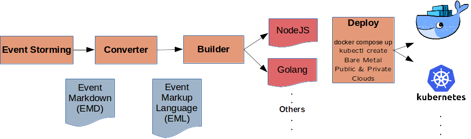

# Thank you for joining us at [LesterCon 2018](https://workshop.adaptechsolutions.net/lestercon2018/) April 12th and 13th in Vancouver for the open source launch.

## Event Sourced Systems, Made Simple

“LESTER” = “Let’s Event Source Together”

LESTER takes a specification for an event sourced system and produces deployment-ready commands, events, documentation and infrastructure. It is designed to make prototyping and starting implementation of an event based system very simple and very closely aligned with business objectives and requirements.

### In:

Event Markdown (EMD) is a machine- and remote collaboration friendly way of doing event storming. It retains what makes the Post-It & paper-on-the-wall version successful: Easy to do. Brings business and technical people together. Fun. Deliberately fuzzy to discourage getting lost in detail not (yet) needed. Event Markup Language (EML) is a simple implementation agnostic YAML based declarative language for describing event sourced systems. Custom business rules and read models in NodeJS or Golang.

### Out:

Fully customizable, non-befuddling, no lock-in developer-friendly NodeJS or Golang. Infrastructure: Event Store and read model databases. Currently supports Eventstore, Postgres, LevelDB, Cassandra. Devops: Docker containers on Kubernetes.

## Frequently Asked Questions

### What is Event Storming?

Event storming is a very nice collaborative way of understanding software requirements and relating them directly to what the business needs. It was invented by Alberto Brandolini.

### What is Event Markdown (EMD)?

EMD is a simple convention-based textual representation of an Event Storming. It attempts to retains the key characteristics which make sticky-on-a-wall, group-of-people event storming so successful, such as deliberate fuzziness. You can try it out at https://webeventstorming.com. https://youtu.be/1Pb4a8lr74E has a 30 second intro.

[EMD Cheat Sheet](EMD-Cheatsheet-0.10.0-alpha.pdf)

### What is “Green” Event Markdown?

“Green” EMD is Event Markdown which contains sufficient information for specifying a complete Event Sourced System in Event Markup Language (EML).

### What is an event sourced system?

An event sourced system consists of one or more state machines, the commands which change their state, events which record the state changes, and read models which can build documents (screens, reports, lookup tables, …) with data from these events. 

### What is Event Markup Language (EML)?

Event Markup Language is a YAML schema for specifying event sourced systems. It is the input for the “les” command line tool which is able to validate whether the specification would result in a “complete” event sourced system.

### What do you mean by “complete” event sourced system”?

A “complete” event sourced system …

 - Records changes to the state of a state machine as a stream of events over time.
 - Can re-build the current state of a state machine from recorded events.
 - Is transactionally consistent:  The current state of a state machine (a.k.a. transaction, event stream, or if DDD is your thing, aggregate) contains all the data needed to make decisions on what the next state should be when commands are processed. Commands succeed or fail atomically.
 - Commands result in state changes.
 - Commands must contain a reference to the state machine whose state they change.
 - State changes are recorded as time stamped events stated in past tense.
 - Events must contain a reference to the state machine whose state changes they record.
 - Read models must not contain any data which they cannot get from subscribing to events.
 - Commands cannot act on state machines which do not exist. Unless executing the command results in creation of a new state machine.
 - Command parameters cannot reference ids of state machines which do not exist.

### What is the “les” command line tool?

 - les validates EML or EMD files for completeness. 
 - les converts EMD to EML.

Think of les as an architect-in-a-box. 

### What is les-node?

Les-node builds an event sourced NodeJS API from EML. 

### What is les-go?

Les-go builds an event sourced Golang API from EML. It is currently very alpha.

### What is les-openapi?

Les-openapi (also known as les-swagger) produces an OpenAPI specification from EML.

### What do les-redux, les-csharp, les-shellscript, les-haskell, les-whitespace and les-akka have in common?

They are not in existence. The only languages for which EML->API builders exist at this point are NodeJS, Golang (to some extent) and OpenAPI.

### What is les-test-http-api?

les-test-http-api tests whether an HTTP API built from a reference EML specification is a complete error-free event sourced system. (a.k.a. “les compliant”). It assumes that certain conventions were followed for routes and API endpoint names. It is implementation language agnostic.

### What is les-I-can’t-stand-code-other-than-my-own?

EML is your hedge against the framework trap (a.k.a. “straight jacket, implemented as mystery code”). It is deliberately implementation- and language-agnostic. Eml-node, eml-go and eml-openapi demonstrate how to turn EML into working APIs and other artifacts. If you prefer (or need) to implement your own version, go ahead.

### What does “les” stand for?

“Les” is short for “Lester”.

### What does “Lester” stand for?

“Lester” is an acronym for “Let’s Event Source Together”

### What about legacy code?

[Legacy Evolution Whitepaper](https://insights.adaptechsolutions.net/legacy-evolution-whitepaper/#adaptech-github-letseventsource)
